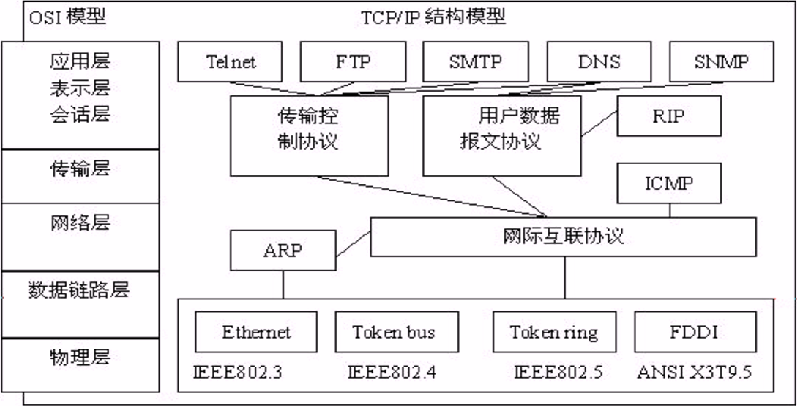
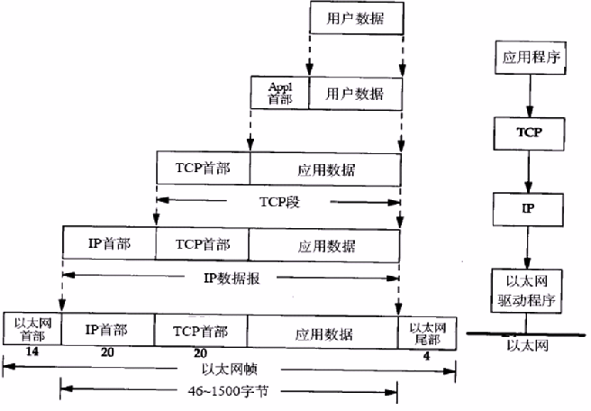
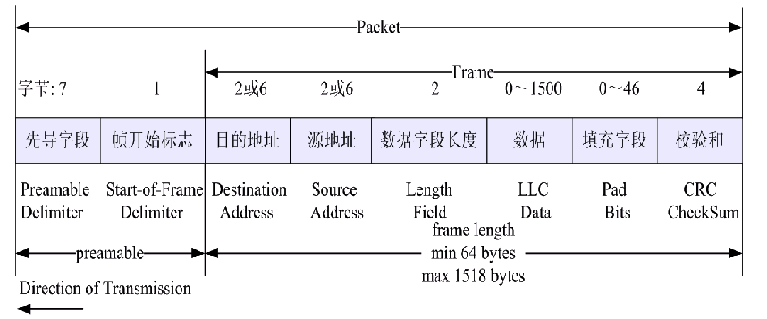
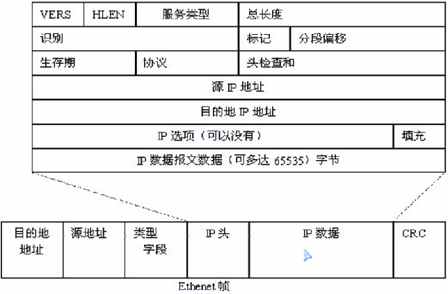
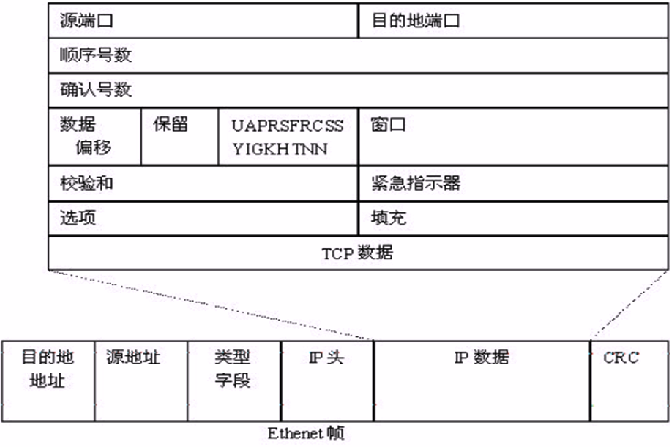
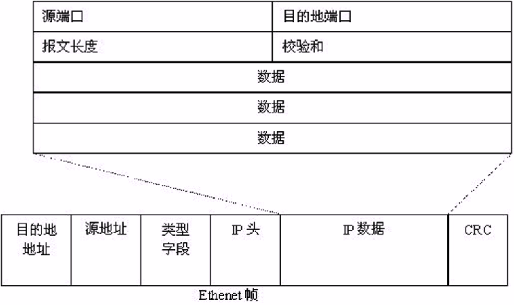
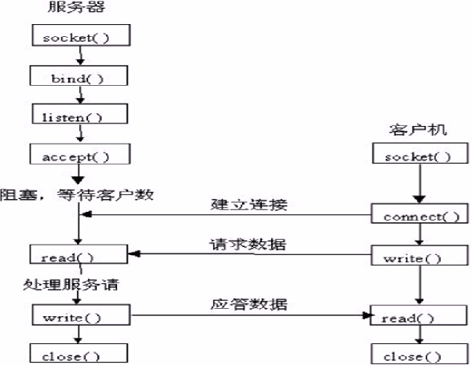
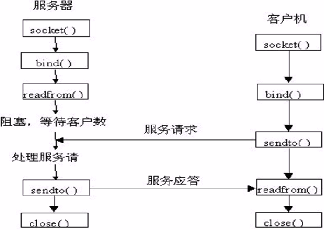

##Linux网络编程

###Linux网络概述

* Linux网络优势 - Linux为用户提供了完善的、强大的网络功能
	1. 完善的内置网络。
	2. 免费提供大量支持Internet的软件. Internet是在Unix领域中建立并繁荣起来的, 在这方面使用Linux是相当方便的, 用户能用Linux与世界上的其他人通过Internet网络进行通讯.
	3. 用户能通过一些Linux命令完成内部信息或文件的传输.
	4. 远程访问.
	5. 安全可靠.

* Linux网络模型

| OSI参考模型 | TCP/IP参考模型 |
| ---------- |:-------------:|
|    应用层   |     应用层     |
|    表示层   |     应用层     |
|    会话层   |     应用层     |
|    传输层   |     传输层     |
|    网络层   |     网络层     |
|  数据链路层  |   网络接口层    |
|    物理层   |   网络接口层    |



* 网络层协议
	1. Internet协议(IP)
		
		> 被设计成互联分组交换通信网, 以形成一个网际通信环境. 它负责在源主机和目标主机之间传输来自其较高层软件的<b>数据报文</b>, 提供<b>非连接型</b>传递服务.
		
	2. 网际控制报文协议(ICMP)
	
		> 它实际上不是IP层部分,但直接同IP层一起工作, 报告网络上的某些出错情况. 允许网际路由器传输差错信息或测试报文.
		
	3. 地址解析协议(ARP)

		> ARP实际上不是网络层部分, 处于IP和数据链路层之间, 它是在32位IP地址和48位物理地址之间执行翻译的协议.

* 传输层协议
	1. 传输控制协议(TCP):

		> 该协议对建立网络上用户进程之间的对话负责, 它确保进程之间的可靠通信, 所提供的功能如下:
		
		1. 监听输入对话建立请求
		2. 请求另一网络站点对话
		3. 可靠的发送和接收数据
		4. 适度的关闭对话

	2. 用户数据报文协议(UDP):

	> UDP提供<b>不可靠的非连接型</b>传输层服务,它允许在源和目标之间传送数据,而不必在传送数据之前建立对话. 主要用于那些非连接型的应用程序, 如视频点播.

* 应用层协议
	1. Telnet
	2. 文件传送协议(FTP/TFTP)
	3. 简单文件传送协议(SMTP)
	4. 域名服务(DNS)
	5. ...

* 协议封装


* 以太网包


* Internet协议(IP) - 主要有以下4个主要功能:
	1. 数据传送
	2. 寻址
	3. 路由选择
	4. 数据报文的分段

> IP的主要目的是为<b>数据输入/输出网络提供基本算法,为高层协议提供无连接的传送服务</b>. 这意味着在IP将数据递交给接收站点以前不在传输站点和接收站点之间建立对话.它只是封装和传递数据,但不向发送者或接收者报告包的状态,不处理所遇到的故障.

> IP包由<b>IP协议头</b>与<b>协议数据</b>两部分构成。



* TCP协议

> TCP是重要的传输层协议, 目的是允许数据同网络上的其他节点进行可靠的交换. 它能提供端口编号的译码,以识别主机的应用程序, 而且完成数据的可靠传输.
> 
> TCP协议具有严格的内装差错检验算法确保数据的完整性.
> 
> TCP是面向字节的顺序协议, 这意味着包内的每个字节被分配一个顺序编号, 并分配给每包一个顺序编号.



* UDP协议

> UDP也是传输层协议, 是<b>不可靠的非连接型</b>传输服务;但执行功能时具有较低开销, 执行速度比TCP快.



###Linux网络编程基础
* Socket

> Linux中的网络编程通过Socket(套接字)实现, Socket是一种文件描述符.

* Socket类型
	1. 流式套接字(SOCK_STREAM)

		> 可提供可靠的、面向连接的通讯流,使用TCP协议.
		
	2. 数据报套接字(SOCK_DGRAM)

		> 定义了一种无连接、不保证可靠无差错的服务,使用数据报协议UDP.
		
	3. 原始套接字(SOCK_RAW)
		> 允许使用IP协议, 主要用于新的网络协议的测试等.

* 网络地址

```
struct sockaddr
{
  u_short sa_family; // 协议族, 如: AF_INET(IP协议族)
  char sa_data[14]; // 14字节的特定协议地址.
}
```
```
// 编程中一般使用与sockaddr等价的sockaddr_in数据结构
struct sockaddr_in
{
  short int sin_family;        // 协议族
  unsigned short int sin_port; // 端口号
  struct in_addr sin_addr;     // 协议特定地址
  unsigned char sin_zero[8];   // 填0
}
```
```
typedef struct in_addr
{
  union
  {
    struct
    {
      unsigned char s_b1;
      unsigned char s_b2;
      unsigned char s_b3;
      unsigned char s_b4;
    }S_un_b;
    struct
    {
      unsigned short s_w1;
      unsigned short s_w2;
    }S_un_w;
    unsigned long S_addr;
  }S_un;
}IN_ADDR;
```

* IP地址转换

// ascii -> network
`int inet_aton(const char *cp, struct in_addr *inp)`

// network -> ascii
`char* inet_ntoa(struct in_addr, in)`

* 字节序转换

> 不同类型的CPU对变量的字节存储顺序可能不一致, 为了网络传输的数据顺序统一, 当内部字节存储顺序和网络字节序(Big Endian)不同时, 就一定要进行转换.

  1. htons - 把unsigned short类型从主机序转换到网络序
  2. htonl - 把unsigned long类型从主机序转换到网络序
  3. ntohs - 把unsigned short类型从网络序转换到主机序
  4. ntohl - 把unsigned long类型从网络序转换到主机序

* IP与主机名

> 在网络中标识一台主机可以用IP地址, 也可以用主机名.

```
struct hostent* gethostbyname(const char* hostname)

struct hostent
{
  char* h_name;       // 主机的正式名称
  char* h_aliases;    // 主机的别名
  int h_addrtype;     // 主机的地址类型 AF_INET
  int h_lenght;       // 主机的地址长度
  char** h_addr_list; // 主机的IP地址列表
}
#define h_addr h_addr_list[0] //主机的第一个IP地址
```

* Socket 编程函数
  1. socket  - 创建一个socket
  2. bind    - 用于绑定IP地址和端口号到socket
  3. connect - 用于与服务器建立连接
  4. listen  - 设置服务器能处理的最大连接要求
  5. accept  - 用来等待来自客户端的socket连接请求.
  6. send    - 发送数据
  7. recv    - 接收数据

###TCP网络程序设计

* TCP Server
  1. socket() - 创建一个socket
  2. bind()   - 绑定IP地址、端口等信息到socket上
  3. listen() - 设置允许的最大连接数
  4. accept() - 等待来自客户端的连接请求
  5. send()/write() - 发送数据
  6. recv()/read()  - 接收数据
  7. close()  - 关闭网络连接

* TCP Client
  1. socket() - 创建一个socket
  2. 设置要连接的服务器IP地址及端口号等属性
  3. connect() - 连接服务器
  4. send()/write() - 发送数据
  5. recv()/read()  - 接收数据
  6. close()  - 关闭网络连接

* TCP Server - Client 通讯模型



```
// --- tcp_server.c ---
#include <stdio.h>
#include <stdlib.h>
#include <string.h>
#include <errno.h>

#include <netdb.h>
#include <netinet/in.h>
#include <sys/types.h>
#include <sys/socket.h>

#define portnumber 3333

int main(int argc, char* argv[])
{
  int sockfd, new_fd;
  struct sockaddr_in server_addr;
  struct sockaddr_in client_addr;
  int sin_size;
  int nbytes;
  char buffer[1024];
  
  // --- 1. 创建一个socket ---
  sockfd = socket(AF_INET, SOCK_STREAM, 0);
  if (sockfd == -1)
  {
    fprintf(stderr, "Socket error:%s\n\a", strerror(errno));
    exit(1);
  }
  // --- 1. 创建一个socket ---
  
  // --- 2. 设置要创建的服务器IP地址及端口号等属性 ---
    // - 初始化, 置0
    bzero(&server_addr, sizeof(struct sockaddr_in));
    
    // - Internet
    server_addr.sin_family = AF_INET;
    
    // - 设置IP地址
    server_addr.sin_addr.s_addr = htonl(INADDR_ANY);
    //server_addr.sin_addr.s_addr = inet_addr("192.168.1.1");
    
    // - 设置端口号
    server_addr.sin_port = htons(portnumber);
  // --- 2. 设置要创建的服务器IP地址及端口号等属性 ---

  // --- 3. 绑定socket到IP地址 ---
  int ret = bind(sockfd, (struct sockaddr *)(&server_addr), sizeof(struct sockaddr));
  if (ret == -1)
  {
    fprintf(stderr, "Bind error:%s\n\a", stderror(errno));
    exit(1);
  }
  // --- 3. 绑定socket到IP地址 ---
  
  // --- 4. 设置允许的最大连接数 ---
  ret = listen(sockfd, 5);
  if (ret == -1)
  {
    fprintf(stderr, "Listen error:%s\n\a", stderror(errno));
    exit(1);
  }
  // --- 4. 设置允许的最大连接数 ---

  while(1)
  {
    // 5. (服务器阻塞) - 等待来自客户端的连接请求
    sin_size = sizeof(struct sockaddr_in);
    new_fd = accept(sockfd, (struct sockaddr*)(&client_addr), &sin_size);
    if (new_fd == -1)
    {
      fprintf(stderr, "Accept error:%s\n\a", strerror(errno));
      exit(1);
    }
    fprintf(stderr, "Server get connection from %s\n", inet_ntoa(client_addr.sin_addr));
    
    // 6. (服务器阻塞) - 读取数据
    nbytes = read(new_fd, buffer, 1024);
    if (nbytes == -1)
    {
      fprintf(stderr, "Read Error:%s\n", strerror(errno));
      exit(1);
    }
    buffer[nbytes] = '0';
    printf("Server received %s\n", buffer);
    
    // 7. 通讯结束 - 关闭本次TCP连接
    close(new_fd);
    
    // -> 循环开始下一次TCP连接通讯
  }
  
  // -> 结束通讯
}
// --- tcp_server.c ---
```
```
// --- tcp_client.c ---
#include <stdio.h>
#include <stdlib.h>
#include <string.h>
#include <errno.h>

#include <netdb.h>
#include <netinet/in.h>
#include <sys/types.h>
#include <sys/socket.h>

#define portnumber 3333
int main(int argc, char* argv[])
{
  int sockfd;
  char buffer[1024];
  struct sockaddr_in server_addr;
  struct hostent* host;
  
  // --- 0. 获取输入参数 ---
  if (argc != 2)
  {
    fprintf(stderr, "Usage:%s hostname \n\a", argv[0]);
    exit(1);
  }
  host = gethostbyname(argv[1]);
  if (host == NULL)
  {
    fprintf(stderr, "Gethostname error\n");
    exit(1);
  }
  // --- 0. 获取输入参数 ---

  // --- 1. 创建一个socket ---
  sockfd = socket(AF_INET, SOCK_STREAM, 0);
  if (sockfd == -1)
  {
    fprintf(stderr, "Socket Error: %s\n\a", strerror(errno));
    exit(1);
  }
  // --- 1. 创建一个socket ---

  // --- 2. 设置要创建的服务器IP地址及端口号等属性 ---
    // - 初始化, 置0
    bzero(&server_addr, sizeof(struct sockaddr_in));
    
    // - Internet
    server_addr.sin_family = AF_INET;
    
    // - 设置IP地址
    server_addr.sin_addr = *((struct in_addr*)host->h_addr);
    
    // - 设置端口号
    server_addr.sin_port = htons(portnumber);
  // --- 2. 设置要创建的服务器IP地址及端口号等属性 ---
  
  // --- 3. 客户端发起连接服务器请求 ---
  int ret = connect(sockfd, (struct sockaddr*)(&server_addr), sizeof(struct sockaddr));
  if (ret == -1)
  {
    fprintf(stderr, "Connect Error:%s\n\a", strerror(errno));
    exit(1);
  }
  // --- 3. 客户端发起连接服务器请求 ---

  // --- 4. 发送数据 ---
  printf ("Please input char:\n");
  fgets(buffer, 1024, stdin);
  write(sockfd, buffer, strlen(buffer));
  // --- 4. 发送数据 ---  
  
  // --- 5. 结束通讯 - 关闭网络连接 ---
  close(sockfd);
  exit(0);
}
// --- tcp_client.c ---
```

###UDP网络程序设计

* UDP Server
  1. socket()   - 创建一个socket
  2. bind()     - 绑定IP地址、端口等信息到socket上
  3. recvfrom() - 循环接收数据
  4. close()    - 关闭网络连接
  
* UDP Client
  1. socket()   - 创建一个socket
  2. bind()     - 绑定IP地址、端口等信息到socket上
  3. 设置对方的IP地址和端口号等属性
  4. sendto()   - 发送数据
  5. close()    - 关闭网络连接

* UDP Server - Client 通讯模型



```
// --- udp_server.c ---
#include <stdio.h>
#include <stdlib.h>
#include <string.h>
#include <errno.h>
#include <unistd.h>

#include <netdb.h>
#include <netinet/in.h>
#include <sys/types.h>
#include <sys/socket.h>
#include <arpa/inet.h>

#define SERVER_PORT   (8888)
#define MAX_MSG_SIZE  (1024)

void udps_respon(int sockfd)
{
  struct sockaddr_in addr;
  int addrlen,n;
  char msg[MAX_MSG_SIZE];
  
  while(1)
  {
    // 从网络上读, 并写到网络上
    bzero(msg, sizeof(msg));
    addrlen = sizeof(sgruct sockaddr);
    n = recvfrom(sockfd, msg, MAX_MSG_SIZE, 0, 
      (struct sockaddr*)&addr, &addrlen);
    msg[n] = '\0';
    
    fprintf(stdout, "Server have received %s", msg);
  }
}

int main(void)
{
  int sockfd;
  struct sockaddr_in addr;
  
  sockfd = socket(AF_INET, SOCK_DGRAM, 0);
  if (sockfd < 0)
  {
    fprintf(stderr, "Socket Error:%s\n", strerror(errno));
    exit(1);
  }
  
  udps_respon(sockfd);
  close(sockfd);
}
// --- udp_server.c ---
```
```
// --- udp_client.c ---
#include <stdio.h>
#include <stdlib.h>
#include <string.h>
#include <errno.h>
#include <unistd.h>

#include <netdb.h>
#include <netinet/in.h>
#include <sys/types.h>
#include <sys/socket.h>
#include <arpa/inet.h>

#define SERVER_PORT   (8888)
#define MAX_MSG_SIZE  (1024)

void udpc_requ(int sockfd, const struct sockaddr_in* addr, int len)
{
  char buffer[MAX_MSG_SIZE];
  int n;
  while(1)
  {
    printf("Please input char:\n");
    fgets(buffer, MAX_MSG_SIZE, stdin);
    sendto(sockfd, buffer, strlen(buffer), 0, addr, len);
    bzero(buffer, MAX_MSG_SIZE);
  }
}
int main(int argc, char** argv)
{
  int sockfd;
  struct sockaddr_in addr;
  
  if (argc != 2)
  {
    fprintf(stderr, "Usage:%s server_ip\n", argv[0]);
    exit(1);
  }
  
  sockfd = socket(AF_INET, SOCK_DGRAM, 0);
  if (sockfd < 0)
  {
    fprintf(stderr, "Socket Error%s\n", strerror(errno));
    exit(1);
  }
  
  bzero(&addr, sizeof(struct sockaddr_in));
  addr.sin_family = AF_INET;
  addr.sin_port = htons(SERVER_PORT);
  if (inet_aton(argv[1], &addr.sin_addr) < 0)
  {
    fprintf(stderr, "Ip error:%s\n", strerror(errno));
    exit(1);
  }
  
  udpc_requ(sockfd, &addr, sizeof(struct sockaddr_in));
  close(sockfd);
}
// --- udp_client.c ---
```

###Linux并发服务器设计

* 服务器模型分类:
  1. 循环服务器 - 服务器在同一时刻只能响应一个客户端的请求
  2. 并发服务器 - 服务器在同一时刻可响应多个客户端的请求

* UDP循环服务器

实现方法: UDP服务器每次从套接字上读取一个客户端的请求->处理->然后将结果返回给客户机.

```
  socket(...);
  bind(...);
  while(1)
  {
    recvfrom(...);
    process(...);
    sendto(...);
  }
```

* TCP循环服务器

TCP循环服务器接受一个客户端的连接,然后处理,完成了这个客户的所有请求后,断开连接.

TCP循环服务器一次只能处理一个客户端的请求. 只有在这个客户的所有请求都满足后,服务器才可以继续后面的请求. 这样<b>如果有一个客户端占住服务器不放时, 其他的客户端都不能工作</b>. 因此,TCP服务器一般很少用循环服务器模型.

```
  socket(...);
  bind(...);
  listen(...);
  
  while(1)
  {
    accept(...);
    process(...);
    close(...);
  }
```

* TCP并发服务器

并发服务器的思想是<b>每一个客户端的请求</b>并不由服务器直接处理,而是<b>由服务器创建一个子进程来处理</b>:

```
  socket(...);
  bind(...);
  listen(...);
  
  while(1)
  {
    accept(...);
    
    if (fork(..) == 0)
    {
      process(...);
      close(...);
      exit(...);
    }
    
    close(...);
  }
```
```
// --- tcp_server_fork.c ---
#include <stdio.h>
#include <stdlib.h>
#include <string.h>
#include <errno.h>

#include <netdb.h>
#include <netinet/in.h>
#include <sys/types.h>
#include <sys/socket.h>

#define  MY_PORT 3333

int main(int argc, char** argv)
{
  int listen_fd, accept_fd;
  struct sockaddr_in client_addr;
  int n;
  int nbytes;
  
  listen_fd = socket(AF_INET, SOCK_STREAM, 0);
  if (listen_fd < 0)
  {
    printf("Socket Error:%s\n\a", strerror(errno));
    exit(1);
  }
  
  bzero(&client_addr, sizeof(struct sockaddr_in));
  client_addr.sin_family = AF_INET;
  client_addr.sin_port = htons(MY_PORT);
  client_addr.sin_addr.s_addr = htonl(INADDR_ANY);
  n = 1;
  
  // 如果服务器终止后,服务器可以第二次快速启动而不用等待一段时间
  setsockopt(listen_fd, SOL_SOCKET, SO_REUSEADDR, &n, sizeof(int));
  if (bind(listen_fd, (struct sockaddr*)&client_addr, sizeof(client_addr)) < 0)
  {
    printf("Bind Error:%s\n\a", strerror(errno));
    exit(1);
  }
  
  listen(listen_fd, 5);
  
  while(1)
  {
    accept_fd = accept(listen_fd, NULL, NULL);
    if (accept_fd < 0)
    {
      if (errno == EINTR)
      {
        continue;
      }
      else
      {
        printf("Accept Error:%s\n\a", strerror(errno));
      }
    }
    
    n = fork();
    if (n == 0)
    {
      char buffer[1024];
      
      nbytes = read(accept_fd, buffer, 1024);
      if (nbytes == -1)
      {
        fprintf(stderr, "Read Error:%dk\n", strerror(errno));
        exit(1);
      }
      buffer[nbytes] = '\0';
      printf("Server received %s\n", buffer);
      
      close(listen_fd);
      close(accept_fd);
      exit(0);
    }
    else
    {
      close(accept_fd);
    }
  }
}
// --- tcp_server_fork.c ---
```


