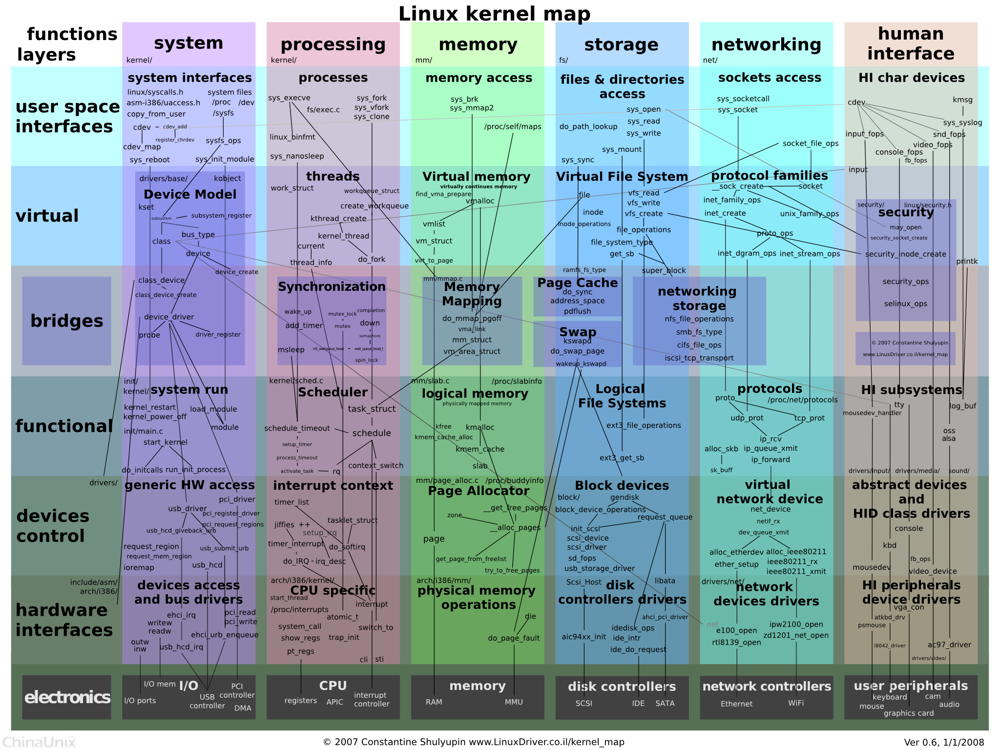
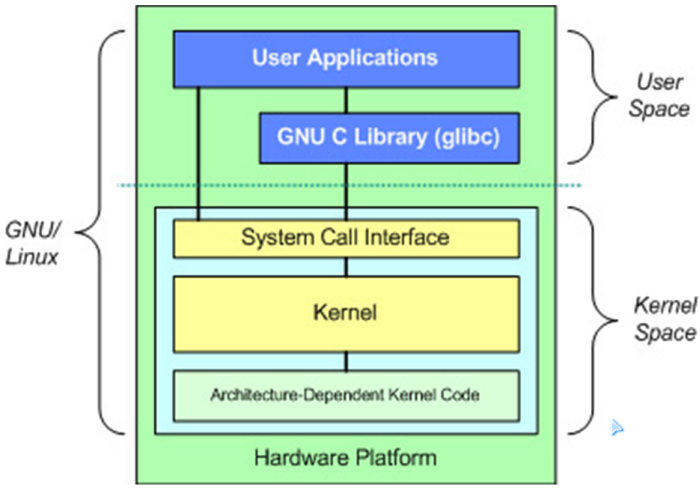
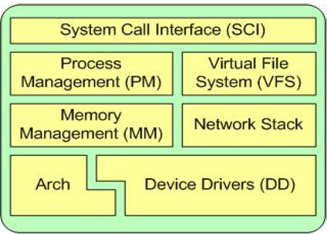

# Linux内核开发基础




## Linux内核简介

* linux体系结构
	1. 用户空间
	2. 内核空间



* Linux划分<b>用户控件</b>与<b>内核空间</b>的作用
> 现代CPU通常实现了不同的工作模式,具有不同级别的硬件权限.
> 
> Linux系统利用CPU这一特性,使用其中的两级来分别运行内核程序与应用程序,这样<b>使得操作系统本身得到充分的保护</b>.
> 
> 内核空间与用户空间是程序执行的两种不同状态,通过<b>系统调用</b>和<b>硬件中断</b>能够完成从用户空间到内核空间的转移.

* Linux内核架构



  1. System Call Interface (SCI) - 系统调用接口
  2. Process Management (PM) - 进程管理
  3. Memory Management (MM) - 内存管理
  4. Network Stack - 网络协议栈
  5. Virtual File System (VFS) - 虚文件系统
  6. Device Drivers (DD) - 设备驱动
  7. Arch - CPU相关代码

## Linux内核源代码

* Linux内核源码下载地址
  www.kernel.org

* Linux内核源码目录结构
	1. arch - (architecture)
		> 内核所支持的每种CPU体系,在该目录下都有对应的子目录。每个CPU的子目录,又进一步分解为boot(系统引导),mm(内存管理),kernel(系统调用)等子目录.
	2. block - 部分块设备驱动程序
	3. crypto - 加密、压缩、CRC校验算法
	4. documentation - 内核文档
	5. drivers - 设备驱动程序
	6. fs - 各种文件系统的实现代码
	7. include - 内核所需要的头文件
		> 与平台无关的头文件在`include/linux`子目录下;
		> 
		> 与平台相关的头文件在相应的子目录下;
	8. init - 内核初始化代码
	9. ipc - 进程间通信的实现代码
	10. kernel - 内核大多数关键的核心功能实现代码
	11. lib - 库文件代码
	12. mm - 用于实现内存管理中与体系结构无关的部分
	13. net - 网络协议的实现代码
	14. samples - 一些内核编程范例
	15. scripts - 配置内核的脚本
	16. security - SELinux的模块
	17. sound - 音频设备的驱动程序
	18. usr - cpio命令实现
	19. virt - 内核虚拟机

## Linux内核配置与编译
* Linux内核具有可定制的优点,具体步骤如下:

	1. 清除临时文件、中间文件和配置文件
		1. `make clean` - remove most generated files but keep the config files
		2. `make mrproper` - remove all generated files and config files
		3. `make distclean` - mrproper + remove editor backup and patch files
	2. 确定目标系统的软硬件配置情况
		> 比如CPU的类型、网卡的型号、所需支持的网络协议等.

	3. 使用如下命令之一配置内核:
		1. `make config`: 基于文本模式的交互式配置
		2. `make menuconfig`: 基于文本模式的菜单型配置(推荐),使用方法如下:
			1. 使用方向键在各选项间移动;
			2. 使用`Enter`键或快捷键(选项上的高亮字母)进入下一层选单;
			3. 在括号中按`y`将这个项目编译进内核中,按`m`编译为模块,按`n`为不选择,按`h`可显示该选项的帮助信息; 按空格可在`y` `m` `n`三者间切换; 按`Esc`将返回到上层选单;
		3. `make oldconfig`: 使用已有的配置文件(.config),但会询问新增的配置选项.
		4. `make xconfig`: 图形化的配置(需安装图形化系统)
	4. 编译内核
		> 使用如下命令之一编译内核 编译好的内核位于`arch/<cpu>/boot/`目录下
		1. `make zImage` - X86平台下只能用于小于512K的内核
		2. `make bzImage`
		3. `make zImage V=1` - 获取详细编译信息
		4. `make bzImage V=1`
	5. 编译内核模块 - `make modules`
	6. 安装内核模块 - `make modules_install`
	7. 制作init ramdisk
	
		`mkinitrd initrd-$version $version`

		例:`mkinitrd initrd-2.6.29 2.6.29`

		$version 可以通过查询`lib/modules`下的目录得到
	8. 内核安装(X86)
		1. `cp arch/x86/boot/bzImage /boot/vmlinuz-$version`
		2. `cp $initrd /boot/`
		3. 修改`/etc/grub.conf`或者`/etc/lilo.conf`


## Linux内核模块开发
* 什么是内核模块?

> Linux内核的整体结构非常庞大,其包含的组件也非常多,如何使用需要的组件呢?

1. 把所有的组件都编译紧内核文件(zImage/bzImage), 缺点:
	1. 生成的内核文件过大; 
	2. 如果要添加或删除某个组件,需要重新编译整个内核.
2. 把部分组件以<b>内核模块</b>的方式编译调用,特点:
	* 模块本身并<b>不被编译紧内核文件</b>
	* 可根据需求,<b>在内核运行期间动态的安装/卸载</b>

* 内核模块程序结构
	1. 模块加载函数(必需) - `module_init`宏指定
	2. 模块卸载函数(必需) - `module_exit`宏指定

```
// 范例:
#include <linux/init.h>
#include <linux/module.h>

static int hello_init(void)
{
  printk(KERN_WARNING"Hello, world!\n");
  return 0;
}

static void hello_exit(void)
{
  printk(KERN_WARNING"Hello, world!\n");
}

module_init(hello_init);
module_exit(hello_exit);
```

* 内核模块的编译 - 通常使用`makefile`
* 如何编写`makefile`, 使得编译中增加内核模块？
  1. 内核模块由一个源文件构成
  2. 内核模块由多个源文件构成
* 内核模块的安装与卸载
  1. 加载 `insmod`
  2. 卸载 `rmmod`
  3. 查看 `lsmod`
  4. 加载 `modprobe`
> `modprobe`与`insmod`区别在于, 前者会根据文件`/lib/modules/<$version>/modules.dep`来查看要加载的模块,是否依赖于其他模块,如果是,将会首先找到这些模块,把它们先加载到内核.

* 内核模块可选信息
	1. 许可证申明 - 宏`MODULE_LICENSE`
	2. 作者申明 - 宏`MODULE_AUTHOR`
	3. 模块描述 - 宏`MODULE_DESCRIPTION`
	4. 模块版本 - 宏`MODULE_VERSION`
	5. 模块别名 - 宏`MODULE_ALIAS`
	6. 模块参数 - 宏`module_param(name, type, perm)`
		1. name - 模块参数的名称.
		2. type - 模块参数的类型. `bool`:布尔型; `int`:整型; `charp`:字符串型;
		3. perm - 模块参数的访问权限. 
			- `S_IRUGO`: 任何用户都对`/sys/module`中出现的该参数具有读权限;
			- `S_IWUSR`: 允许root用户修改`/sys/module`中出现的该参数;


* 内核符号导出
	1. `/proc/kallsyms`记录了内核中所有导出的符号的名字与地址
	2. 为什么要导出内核符号?
	3. 内核符号的导出使用:
		* `EXPORT_SYMBOL()`
		* `EXPORT_SYMBOL_GPL()` - 只能用于包含GPL许可证的模块.
* 常见问题
	1. 版本不匹配: 
		- 原因: 内核模块的版本由其所依赖的内核代码版本所决定,在加载内核模块时,`insmod`程序会将内核模块版本与当前正在运行的内核版本比较,如果不一致将会报错.
		- 解决方法: 
			1. 使用`modprobe --force-modversion`强行插入
			2. 确保编译内核模块时,所依赖的内核代码版本与当前正在运行的内核版本一致.
			3. 可通过`uname -r`查看当前运行的内核版本
* 内核模块与应用程序的区别:
	1. 应用程序是从头到尾执行任务,执行结束后从内存中消失;
	2. 内核模块是先在内核中注册资金以便服务于将来的某个请求,然后它的初始化函数结束,此时模块仍然存在于内核中,知道卸载函数被调用,模块才从内核中消失;

* 内核打印 - `printk`与`printf`区别:
	1. `printk`在内核中使用; `printf`在应用程序中使用;
	2. `printk`允许根据严重程度,通过附加不同的"优先级"来对消息分类; 按照优先级递减的顺序分别为:
		1. `KERN_EMERG` - 用于紧急消息
		2. `KERN_ALERT` - 需要立即行动的消息
		3. `KERN_CRIT` - 严重情况
		4. `KERN_ERR` - 错误情况
		5. `KERN_WARNING` - 有问题的警告
		6. `KERN_NOTICE` - 正常情况,但是仍然值得注意
		7. `KERN_INFO` - 信息型消息
		8. `KERN_DEBUG` - 用作调试信息
	
	> 没有指定优先级的`printk`默认使用`DEFAULT_MESSAGE_LOGLEVEL`优先级,是一个在`kernel/printk.c`中定义的整数
	> 
	> 控制台优先级配置 `/proc/sys/kernel/printk 6 4 1 7`
	> 
	> `Console_loglevel`
	> 
	> `Default_message_loglevel`
	> 
	> `Minimum_console_level`
	> 
	> `Default_console_loglevel`
	> 


