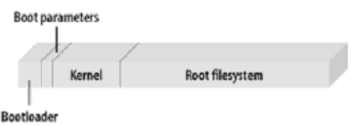
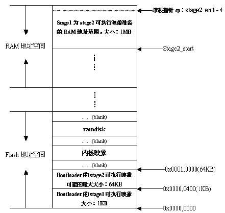

# U-BOOT基础

## 1. BootLoader介绍

 * 什么是BootLoader?

> 一个嵌入式系统从软件角度来看分为三个层次
> 1. 引导加载程序 - 包括固化在固件中的boot程序(可选)和BootLoader程序
> 2. Linux内核 - 特定于嵌入式平台的定制内核
> 3. 文件系统 - 包括了系统命令和应用程序

一个同时装有<b>BootLoader</b>、<b>内核启动参数</b>、<b>内核映像</b>和<b>根文件系统</b>映像的固态存储设备的典型空间分配结构图:

BootLoader主要用于完成<b>整个系统的加载启动任务</b>, 是在操作系统运行之前所运行的<b>一段小程序</b>。通过这段小程序,可以<b>初始化硬件设备</b>,从而将系统软硬件环境带到一个合适的状态,以便为最终<b>调用操作系统</b>做好准备。

* BootLoader安装

系统加电或复位后,所有CPU通常都从CPU制造商预先设定的地址开始执行。而嵌入式系统则将固态存储设备(如:FLASH)安排在这个地址上,而BootLoader程序又安排在固态存储器的最前端,这样就能保证在系统加电后,CPU首先执行BootLoader程序.

* BootLoader启动流程

BootLoader大多采用两阶段,即stage1和stage2:

  1. stage1
    - 完成初始化硬件
    - 为stage2准备内存空间
    - 并将stage2复制到内存中
    - 设置堆栈
    - 然后跳转到stage2.
  2. stage2
    - 初始化本阶段要使用到的硬件设备
    - 将内核映像和根文件系统映像从flash上读到RAM中
    - 调用内核

* Bootloader工作模式

  1. 启动模式
    >　从目标机上的某个固态存储设备上将操作系统自动加载到RAM中运行，整个过程并没有用户的介入

  2. 下载模式
    > 目标机上的BootLoader将通过串口或网络等从主机下载文件, 然后控制启动流程.

## 2. 交叉工具链

* 安装交叉工具链
  1. 解压工具链到某一目录下;
  2. 修改`/etc/profile`, 添加`pathmunge/4.5.1/bin`
  3. 启动生效对环境变量的修改: `source /etc/profile`

* 使用交叉工具链
  1. 编译器: `arm-linux-gcc`
  2. 反汇编工具: `arm-linux-objdump`
  3. ELF文件查看工具: `arm-linux-readelf`

## 3. U-Boot介绍

## 4. U-Boot命令
