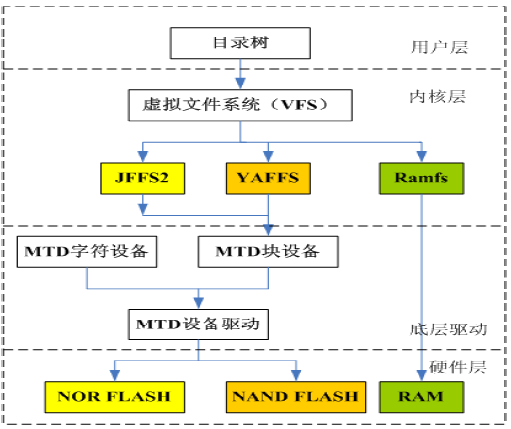

# 嵌入式Linux系统构建

## 嵌入式Linux内核制作

* 嵌入式Linux系统组成

嵌入式Linux系统由Linux内核与根文件系统两部分构成,两者缺一不可.

* 嵌入式Linux内核制作

制作嵌入式Linux内核的方法和制作PC平台的Linux内核基本一致:

  1. 清除原有配置与中间文件

    `x86: make distclean`
    `arm: make distclean`

  2. 配置内核

    `x86: make menuconfig`
    `arm: make menuconfig ARCH=arm`

  3. 编译内核

    `x86: make bzImage`
    `arm: make uImage ARCH=arm CROSS_COMPILE=arm-linux-`

## 根文件系统

* 如何制作嵌入式Linux所需的文件系统?

  1. 创建根文件系统的目录

    `mkdir rootfs`
    `cd rootfs`
    `mkdir bin dev etc lib proc sbin sys usr mnt tmp var`
    `mkdir usr/bin usr/lib usr/sbin lib/modules`

  2. 创建设备文件

    `cd dev/`
    `mknod -m 666 console c 5 1`
    `mknod -m 666 null c 1 3`
    `cd ..`

  3. 安装/etc

    `tar etc.tar.gz -C /xxx/rootfs`

  4. 编译内核模块

    `make modules ARCH=arm CROSS_COMPILE=arm-linux-`

  5. 安装内核模块

    `make modules_install ARCH=arm INSTALL_MOD_PATH=/xxx/rootfs`

  6. 配置busybox

    - 进入busybox目录执行 `make menuconfig`
    - 进入`busybox Setting` -> `build Options` ->
      - 选中`Build busybox as a static binary`, 静态链接.
      - `Cross Compiler prefix` (arm-linux-)
      - `Installation Options` ->
      - 选中`Don't use /usr` 选中该项可避免busybox被安装到宿主系统的`/usr`目录下, 破坏宿主系统.
      - `Busybox Installation Prefix` (/xxx/rootfs)

    7. 编译、安装busybox

      `make ARCH=arm CROSS_COMPILE=arm-linux-`
      `make install`

## 嵌入式文件系统

* 多文件系统支持

  Linux支持多种文件系统类型, 包括ext2、ext3、vfat、jffs、romfs和nfs等, 为了对各类文件系统进行统一管理, Linux引入了虚拟文件系统VFS(Virtual File System), 为各类文件系统提供一个统一的应用编程接口.

  

* 文件系统类型

  嵌入式Linux中, 主要的存储设备为RAM和Flash, 常用的基于存储设备的文件系统类型包括: jffs2, yaffs, cramfs, ramdisk, ramfs等.

* 基于Flash的文件系统
  1. `jffs/jffs2/jffsx` - 主要用于NorFlash
  2. `yaffs/yaffs2` - 主要用于NandFlash
  3. `cramfs` - 一种只读的压缩文件系统, 以压缩方式存储, 运行时解压缩后再拷贝到RAM里去运行.
  4. `ramdisk` - 将一部分固定大小的内存当做块设备来使用, 实质是一种将实际的文件系统装入内存的机制.
  5. `initramfs` - 一种基于内存的文件系统.内存大小可实时变化,根据使用情况自动增加或减小占用内存大小.
  6. `NFS` - 一种通过网络共享文件的技术, 可以看做是基于网络访问存储的文件系统.

* 使用initramfs
  1. 配置Linux内核, 支持initramfs
  2. 进入制作好的根文件系统中, 执行
    `ln -s ./bin/busybox init`
  3. 重新编译内核

* 使用NFS为根文件系统
