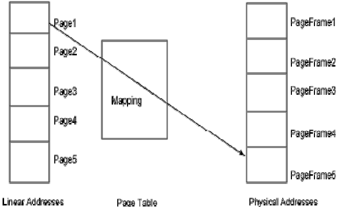

# Linux内存管理子系统

## Linux内存管理

> 内存是Linux内核所管理的最重要的资源之一, 内存管理子系统是操作系统中最重要的部分之一.
> 对于从事Linux系统开发的工程师来说, 熟悉Linux内存管理子系统非常重要

* 地址类型
  1. 物理地址
    - 出现在CPU地址总线上的寻址物理内存的地址信号, 是地址变换的最终结果.
  2. 线性地址(虚拟地址)
    - 在32位CPU架构下, 可以表示4G的地址空间.
    - 用16进制表示就是 0x00000000 到 0xFFFFFFFF
  3. 逻辑地址
    - 程序代码经过编译后, 出现在汇编程序中的地址
* 地址转换
  1. Step1. [Logical Address] ---(Segmented unit)---> [Liner Address]
  2. Step2. [Liner Address] ---(Paging unit)---> [Physical Address]
* 段式管理
  - 16位CPU内部地址总线为20位(1M的内存空间), 但存放地址的寄存器只有16位(64K内存空间), 因此CPU采用了内存分段的管理模式, 加入段寄存器, 把1M内存空间分为若干个逻辑段, 每个逻辑段要求如下:
    1. 逻辑段起始地址(段地址)必须为16的倍数 -> 二进制后4位为0 -> 前16位保存为段基地址
    2. 逻辑段的最大容量为64K
  - 逻辑地址由<b>段地址</b>和<b>偏移地址</b>组成,分别存放在两个16位寄存器中;
    - `线性地址 = 段寄存器值*16 + 偏移地址寄存器值`
  - 16位CPU有4个段寄存器, 程序可同时访问4个不同含义的段.
    1. CS + IP: 用于代码段的访问.
    2. SS + SP: 用于堆栈段的访问.
    3. DS + BX: 用于数据段的访问.
    4. ES + BX: 用于附加段的访问.
  - 32位CPU仍然采用分段的管理模式, 但32位CPU采用了两种不同的工作方式:
    1. 实模式. - 与16位一致;
    2. 保护模式
      - 段基地址32位, 每个段的最大容量为4G;
      - 段寄存器值 -> 段地址的选择器;
      - 选择器 -> 从内存中得到一个32位的段地址;
      - 物理地址 = 段地址 + 段内偏移量;
  - 32位CPU内有6个段寄存器, 其值在不同的模式下具有不同的含义:
    1. 实模式下:
      - 段寄存器值*16 => 段地址
    2. 保护模式下:
      - 段寄存器值是一个选择器, 间接指出一个32位的段地址

    

* 分页管理
  1. 线性地址页 - 线性地址被分为固定长度的页(page);
  2. 物理页(页框/页桢) - 物理内存也被分页单元划分为固定长度的页, 长度一般与线性地址页一致.

  

  1. 分页单元中, 页目录的地址放在CPU的cr3寄存器中, 是进行地址转换的开始点.
  2. 每一个进程, 都有其独立的虚拟地址空间, 运行一个进程, 首先需要将它的页目录地址放到cr3寄存器中, 将其他进程的保存下来.
  3. 每一个32位的线性地址被划分为三部分: 页目录索引(10位); 页表索引(10位); 偏移(12位);

  

  - 依据以下步骤进行地址转换:
    1. 装入进程的页目录地址(OS在调度进程时, 把这个地址装入CR3);
    2. 根据线性地址前10位, 在页目录中, 找到对应索引项, 页目录中的项是一个页表的地址;
    3. 根据线性地址的中间10位, 在页表中找到页的起始地址;
    4. 将页的起始地址与线性地址的最后12位相加, 得到物理地址;

* Linux内存管理
  - Linux内核的设计仅仅有限度的使用了分段机制: 所有段的基地址均为0, 每个段的逻辑地址空间范围均为(0-4GB) => 逻辑地址与线性地址保持一致(逻辑地址的偏移量值 = 线性地址值) => Linux把段机制绕过去,完全利用了分页机制;
  - Linux采用了四级页管理架构, 以兼容二级、三级、四级页管理架构的CPU, 这四级分别为:
    1. 页全局目录;
    2. 页上级目录;
    3. 页中间目录;
    4. 页表;

  

## Linux进程地址空间

* 虚拟内存

  - Linux 采用虚拟内存管理技术, 使得每个进程都有独立的进程地址空间(大小3GB), 不仅保护OS, 用户程序可使用比实际物理内存更大的地址空间.

  - Linux 将4G的虚拟地址(线性地址)空间划分为2部分:
    1. 0x00000000 - 0xBFFFFFFF (3GB): 用户空间
    2. 0xC0000000 - 0xFFFFFFFF (1GB): 内核空间

  - 用户空间对应进程, 所以每当进程切换, 用户空间也会变化; 每个进程的用户空间完全独立, 互不相干; fork()/execve()/malloc() 等申请和获得的不是物理地址, 仅是虚拟地址;

  - 实际的物理内存只有当进程真的去访问新获取的虚拟地址时, 才会由"请页机制"产生"缺页异常", 从而进入分配实际物理页(页框/页桢)的程序;

* 动态内存分配
  1. `malloc()` - 应用程序中使用
  2. `kmalloc()` - 内核程序中使用

  ```
  #include <linux/slab.h>
  void* kmalloc(size_t size, int flags)
  size: 申请的内存大小;
  flags: 分配标志:
    - GFP_KERNEL - 在进程上下文中时分配内存, 可能睡眠;
    - GFP_ATOMIC - 在进程上下文之外时分配内存, 从不睡眠;
    - __GFP_DMA - 要求分配能够DMA的内存区(物理地址在16M以下的页桢)
    - __GFP_HIGHMEM - 要求分配高端内存. (896M以上)
  ```
* 按页分配内存

  1. `get_zeroed_page(unsigned int flags)` - 返回指向新页面的指针, 并将页面清零;
  2. `__get_free_page(unsigned int flags)` - 和`get_free_page`类似, 但不清零页面;
  3. `__get_free_pages(unsigned int flags, unsigned int order)` - 分配若干个连续的页面, 不清零这段内存区域;
  4. `void free_page(unsigned long addr)` - 释放页面内存
  5. `void free_pages(unsigned long addr, unsigned long order)`

  注意: <b>如果释放的和先前分配数目不等的页面, 会导致系统错误</b>

  

## Linux内核地址空间

* 内核空间
  - 内核空间由内核负责映射, 并不会跟着进程改变, 是固定的;
* 高端内存
  - 物理内存896MB以上的部分
* 内核空间分布

  

  - 直接映射区 (Direct Memory Region), 从3G开始, 最大896M的线性地址区间, => `线性地址 = 3G + 物理地址`
  - 动态映射区 (Vmalloc Region), 该区域的地址由内核函数vmalloc进行分配, 线性空间连续, 但对应的物理空间不一定连续. 可能处于低端内存或高端内存;
  - 永久内存映射区(PKMap Region) - 用于对896MB以上的高端内存进行访问映射;
  - 固定映射区(Fixing Mapping Region) - 线性空间4MB, 和4GB顶端只有4K的隔离带, 每个地址项都服务于特定用途;

## Linux内核链表

* 链表简介

  - 优点:
    1. 建立链表时无需预知数据总量;
    2. 可随机分配空间;
    3. 可高效的在链表中任意位置实时插入或删除数据;

  - 基本数据结构: <b>数据域</b>和<b>指针域</b>
  - 类型:
    1. 单链表;
    2. 双链表;
    3. 循环链表;

* 内核链表

  - 数据结构实现: `include/linux/list.h`

  ```
  // 内核链表数据结构定义 => 双向循环链表
  struct list_head
  {
    struct list_head *next, *prev;
  }
  ```
  - 内核链表操作
    1. 初始化链表头
      - `INIT_LIST_HEAD(list_head *head)`
    2. 插入节点
      - `list_add(struct list_head *new, struct list_head *head)`
      - `list_add_tail(struct list_head *new, struct list_head *head)`
    3. 删除节点
      - `list_del(struct list_head *entry)`
    4. 提取数据结构
      - `list_entry(ptr, type, member)`
    5. 遍历链表
      - `list_for_each(struct list_head *pos, struct list_head *head)`

  ```
  struct list_head *entry;
  struct list_head cs46xx_devs; //链表头

  list_for_each(entry, &cs46xx_devs)
  {
    card = list_entry(entry, struct cs_card, list);
    if (card->dev_midi == minor)
    {
      break;
    }
  }
  ```

## Linux内核定时器

* 度量时间差

  - 时钟中断: 频率由内核根据HZ来确定, 可配置(50-1200), X86默认1000
  - 每当时钟中断出现, 全局变量`jiffies(unsigned long)`就加1, 记录了自Linux启动后时钟中断发生的次数, 驱动程序常利用该变量计算不同事件间的时间间隔.

* 延迟执行

```
// 忙等待
unsigned long j = jiffies + jit_delay*HZ;
while(jiffies < j)
{
  // do nothing;
}
```

* 内核定时器

  - 用途:
    - 用于控制某个函数(定时器处理函数)在未来的某个特定事件执行(一次, 不是循环执行);
  - 结构描述:

```
    struct timer_list
    {
      struct list_head entry; // 内核使用
      unsigned long expires;  // 超时的jiffies值
      void (*function)(unsigned long); // 超时处理函数
      unsigned long data;     // 超时处理函数参数
      struct tvec_base *base  // 内核使用
    }
```

  - 函数:
    - 初始化定时器队列结构
      - `void init_timer(struct timer_list *timer);`
    - 启动定时器
      - `void add_timer(struct timer_list *timer);`
    - 删除定时器(在超时前)
      - `int del_timer(struct timer_list *timer);`
