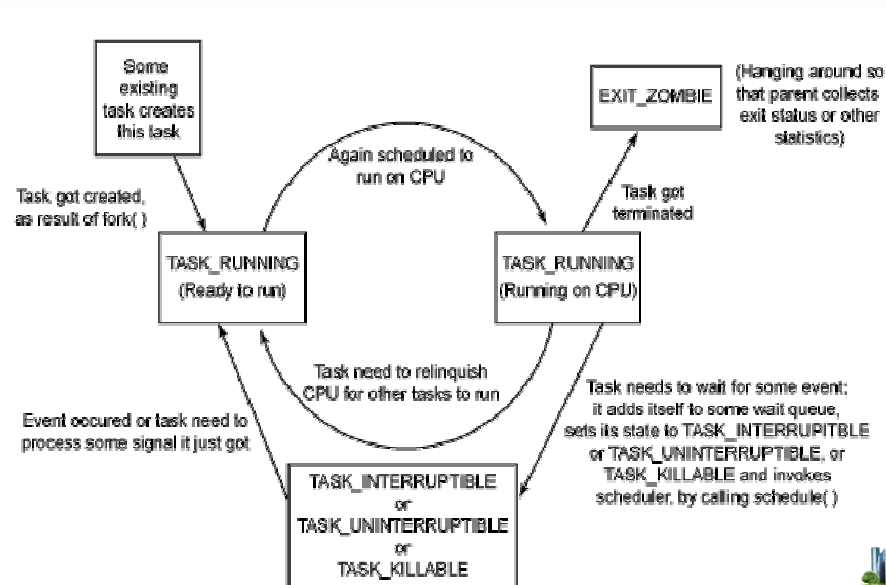
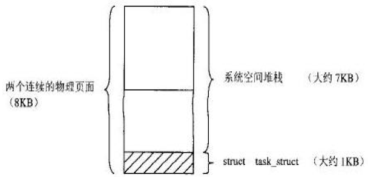
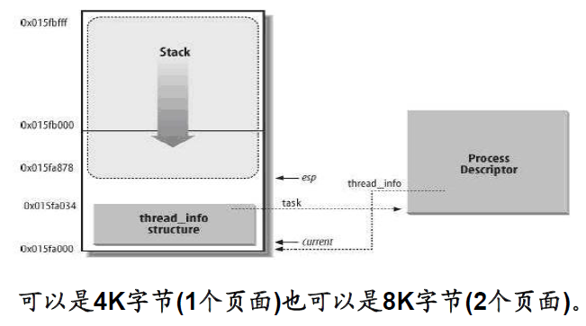
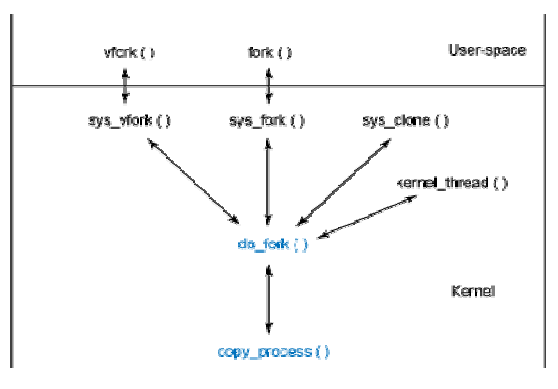
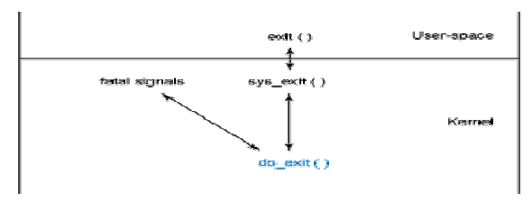

# Linux进程管理子系统

## Linux进程控制

* 进程和程序的区别
  - 程序是存放在磁盘上的一系列代码和数据的可执行映像, 是一个静止的实体;
  - 进程是一个执行中的程序, 是一个动态的实体;

* 进程四要素:
  - 有一段程序供其执行;
  - 有进程专用的内核空间堆栈;
  - 在内核中有一个task_struct数据结构, 即进程控制块;
  - 有独立的用户空间;

* 进程描述
  - Linux中, 线程、进程都使用`struct task_struct`表示, 包含大量描述进程/线程的信息:
    - `pid_t pid` - 进程号/线程号;
    - `volatile long state` - 进程状态;
      1. `TASK_RUNNING`
      2. `TASK_INTERRUPTIBLE`
      3. `TASK_UNINTERRUPTIBLE`
      4. `TASK_STOPPED`
      5. `TASK_KILLABLE`
      6. `TASK_TRACED`
      7. `TASK_DEAD`
    - `int exit_state` - 进程退出时的状态
      1. `EXIT_ZOMBIE` - 僵死进程
      2. `EXIT_DEAD` - 僵死撤销状态

    

    - `struct mm_struct *mm` - 进程用户空间描述指针, 内核线程该指针为空
    - `unsigned int policy` - 该进程的调度策略
    - `int prio` - 优先级, 相当于2.4中`goodness()`的计算结果.
    - `int static_prio` - 静态优先级, 仅影响非实时进程的优先级, 进程初始时间片的大小仅决定于进程的静态优先级;
    - `struct sched_rt_entity rt` - 时间片

    
    

* Current指针
  - Linux中用`current`指针指向当前正在运行的进程的`task_struct`

* 进程创建

  

* 进程销毁

  

  - 进程销毁可通过以下事件驱动:
    1. 通过正常的进程结束;
    2. 通过信号;
    3. 通过对`exit()`函数的调用;
  - 不管进程如何退出, 进程的结束都要借助对内核函数`do_exit()`的调用

## Linux进程调度

* 什么是调度
  - 从就绪的进程中选出最合适的一个来执行

* 调度策略
  - `SCHED_NORMAL(SCHED_OTHER)`: 普通的分时进程
  - `SCHED_FIFO`: 先进先出的实时进程
  - `SCHED_RR`: 时间片轮转的实时进程
  - `SCHED_BATCH`: 批处理进程
  - `SCHED_IDLE`: 只在系统空闲时才能被调度执行的进程

* 调度类

  - 调度类的引入增强了内核调度程序的可扩展性,这些类(调度程序模块)封装了调度策略, 并将调度策略模块化.
    - CFS调度类 (在`kernel/sched_fair.c`中实现)用于以下调度策略: `SCHED_NORMAL`/`SCHED_BATCH`/`SCHED_IDLE`;
    - 实时调度类 (在`kernel/sched_rt.c`中实现)用于`SCHED_RR`/`SCHED_FIFO`策略.

```
struct sched_class
{
  struct sched_class *next;

  void (*enqueue_task)(struct rq *rq, struct task_struct *p, int wakeup);
  void (*dequeue_task)(struct rq *rq, struct task_struct *p, int sleep);

  void (*yield_task)(struct rq *rq, struct task_struct *p);
  void (*check_preempt_curr)(struct rq *rq, struct task_struct *p);

  struct task_struct* (pick_next_task)(struct rq *rq); //选择下一个要运行的进程
  void (*put_prev_task)(struct rq *rq, struct task_struct *p);

  unsigned long (*load_balance)(
    struct rq *this_rq, int this_cpu, struct rq *busiest,
    unsigned long max_nr_move, unsigned long max_load_move,
    struct sched_domain *sd, enum cpu_idle_type idle,
    int *all_pinned, int *this_best_prio);

  void (*set_curr_task)(struct rq *rq);
  void (*task_tick)(struct rq *rq, struct task_struct *p);
  void (*task_new)(struct rq *rq, struct task_struct *p);
}
```

* 调度时机
  1. 主动式
    - 在内核中直接调用`schedule()`
      ```
      // 例子:
      current->state = TASK_INTERRUPTIBLE;
      schedule();
      ```
  2. 被动式(抢占)
    - 用户抢占 - 内核即将返回用户空间时, 如果`need_resched`被置位,就会发生用户抢占.
      - 从系统调用返回用户空间时;
      - 从中断处理程序返回用户空间时;
    - 内核抢占
      - 不支持内核抢占的系统, 进程/线程一旦运行于内核空间, 就可以一直执行, 直到它主动放弃或时间片耗尽;
      - 支持内核抢占的系统, 更高优先级的进程/线程可抢占正在内核空间运行的低优先级进程/线程;
      - 支持内核抢占的系统, 某些特例下不允许内核抢占:
        1. 内核正在进行中断处理;
        2. 内核正在进行中断上下文的BottomHalf处理;
        3. 进程正持有`spinlock`自旋锁、`writelock/readlock`读写锁等;
        4. 内核正在执行调度程序`Scheduler`;
      - 内核抢占可能发生在:
        1. 中断处理程序完成, 返回内核空间前;
        2. 当内核代码再次具有可抢占性的时候, 如解锁及使能软中断等;

* 调度标志 - `TIF_NEED_RESCHED`
  - 作用:
    - 内核提供了一个`need_resched`标志来表明是否需要重新执行一次调度;
  - 设置:
    1. 当某个进程耗尽它的时间片时, 会设置这个标志;
    2. 当一个优先级更高的进程进入可执行状态的时候, 也会设置这个标志;

* 调度步骤 - `Schedule`函数工作流程:
  1. 清理当前运行中的进程;
  2. 选择下一个要运行的进程 (`pick_next_task`分析);
  3. 设置新进程的运行环境;
  4. 进程上下文切换;

## Linux系统调用

* 定义
  - Linux内核中设置了一组用于实现各种系统功能的函数, 称为系统调用. 用户可以通过系统调用命令在自己的应用程序中调用它们.
* 区别
  1. 系统调用由操作系统内核实现, 运行于内核态;
  2. 普通函数调用由函数库或用户自己提供, 运行于用户态;
* 库函数
  - Linux提供了一些C语言函数库, 这些库函数对系统调用进行了一些包装和扩展;
* 系统调用数
  - `arch/arm/include/asm/unistd.h`中可找到系统调用;

* 系统调用的工作原理
  - 应用程序首先用适当的值填充寄存器, 然后调用一个特殊的指令跳转到内核某一固定的位置, 内核根据应用程序所填充的固定值找到相应的函数执行
    1. 适当的值
      - 系统调用号, 在文件`include/asm/unistd.h`中为每个系统调用规定了唯一的编号;
    2. 特殊的指令
      - Intel CPU中, 该指令由中断0x80实现;
      - ARM中, 该指令是SWI(SVC)指令
    3. 固定的位置
      - ARM体系中, 该位置是 `ENTRY(vector_swi) <entry-common.S>`
    4. 相应的函数
      - 内核根据应用程序传递来的系统调用号, 从系统调用表`sys_call_table`找到相应的内核函数;
      - `CALL(sys_restart_syscall)`
      - `CALL(sys_exit)`
      - `CALL(sys_fock_wrapper)`

* 向内核中添加新的系统调用:
  1. 添加新的内核函数;
  2. 更新头文件 `unistd.h`
  3. 针对这个新函数更新系统调用表`calls.S`

* 实现系统调用
  1. 在`kernel/sys.c`中添加函数:

```
// asmlinkage - 使用栈传递参数
asmlinkage int sys_add(int a, int b)
{
  return a+b;
}
```

  2. 在`arch/arm/include/asm/unistd.h`中添加如下代码

```
#define __NR_add (__NR_SYSCALL_BASE+361)
```

  3. 在`arch/arm/kernel/calls.S`中添加代码, 指向新实现的系统调用:

```
CALL(sys_add)
```

  4. 应用程序使用系统调用

```
#include <stdio.h>
#include <linux/unistd.h>

int main (void)
{
  int result = syscall(361, 1, 2);
  printf("result = %d", result);

  return result;
}
```

## Proc文件系统

* 什么是proc文件系统?
  - 通过`/proc/meminfo`, 查询当前内存使用情况;
  - proc文件系统是一种在用户态检查内核状态的机制

| 子目录/文件名 | 内容描述 |
| ---------- |:-------------:|
| apm | 高级电源管理信息 |
| bus  | 总线以及总线上的设备 |
| devices | 可用的设备信息 |
| driver  | 已经启用的驱动程序 |
| interrupts | 中断信息 |
| ioports | 端口使用信息 |
| version | 内核版本 |

* 特点
  1. 每个文件都规定了严格的权限;
  2. 可以用文本编辑程序读取;
  3. 不仅可以有文件, 还可以有子目录;
  4. 可以自己编写程序添加一个`/proc`目录下的文件;
  5. 文件的内容都是动态创建的, 并不存在于磁盘上;

* 内核描述

```
struct proc_dir_entry
{
  read_proc_t *read_proc;
  write_proc_t *write_proc;
}
```

* 创建文件

```
struct proc_dir_entry* create_proc_entry(
  const char *name, mode_t mode, struct proc_dir_entry *parent)

function: 创建proc文件
parameters:
  - name: 要创建的文件名
  - mode: 要创建的文件的属性
  - parent: 该文件的父目录
```

* 创建目录

```
struct proc_dir_entry* proc_mkdir(
  const char *name, struct proc_dir_entry *parent)

  function: 创建proc目录
  parameters:
    - name: 要创建的目录名
    - parent: 该目录的父目录
```

* 删除目录/文件

```
void remove_proc_entry(
  const char *name, struct proc_dir_entry *parent)

  function: 删除proc文件/目录
  parameters:
    - name: 要删除的文件/目录名
    - parent: 所在的父目录
```

* 文件读写
  - 为了能让用户读写添加的proc文件, 需要挂接上读写回调函数:
    - `read_proc`
    - `write_proc`
  - 读操作

```
int read_func(char* buffer, char** stat,
  off_t off, int count, int *peof, void *data)
parameters:
  - buffer: 把要返回给用户的信息写在buffer里, 最大不超过PAGE_SIZE;
  - stat: 一般不使用;
  - off: 偏移量;
  - count: 用户要取的字节数;
  - peof: 读到文件尾时, 需要把*peof置1
  - data: 一般不使用;
```

  - 写操作

```
int write_func(struct file *file, const char *buffer,
  unsigned long count, void *data)
parameters:
  - file: 该proc文件对应的file结构, 一般忽略;
  - buffer: 待写的数据所在的位置
  - count: 待写数据的大小
  - data: 一般不使用
```

* 实现流程
  1. 调用`create_proc_entry`创建一个`struct proc_dir_entry`;
  2. 对创建的`struct proc_dir_entry`进行赋值: `read_proc`, `mode`, `owner`, `size`, `write_proc`等;

## Linux内核异常

* "Oops"信息定义
  - 内核级的`Segmentation Fault`. 应用程序进行了非法内存访问或执行了非法指令, 会得到`Segmentation Fault`信号, 一般的行为是coredump, 应用程序也可以自己截获`Segmentation Fault`信号, 自行处理. 如果内核自己犯了这样的错误, 则会打出"Oops"信息

* 分析步骤
  1. 错误原因提示
  2. 调用栈 (对照反汇编代码)
  3. 寄存器
