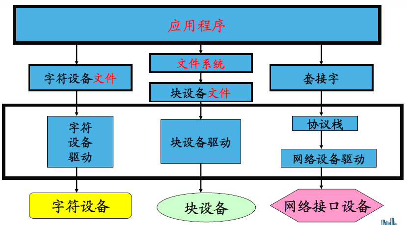
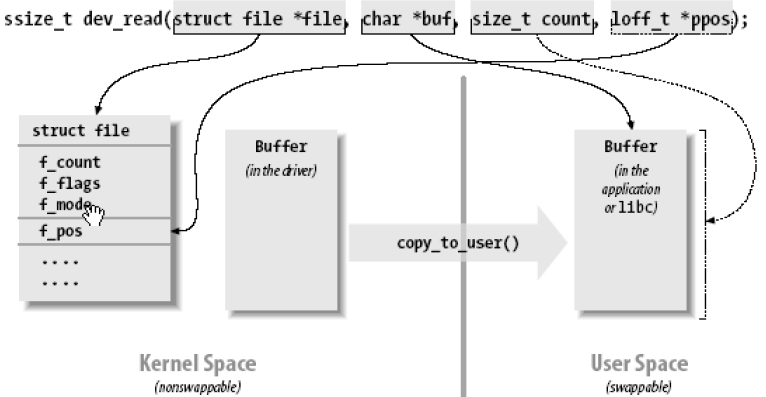

# Linux 字符设备驱动程序

## 驱动程序介绍

* 驱动分类
  1. 字符设备驱动
    - 字符设备是一种按字节来访问的设备, 字符设备驱动则负责驱动字符设备;
  2. 网络接口驱动
    - 一个网络接口负责发送和接收数据报文;
    - 任何网络事务都通过一个接口来进行, 一个接口通常是一个硬件设备(eth0), 但它也可以是一个纯粹的软件设备, 比如回环接口(lo);
  3. 块设备驱动
    - 大部分的Unix系统, 块设备不能按字节处理数据, 只能一次传送一个或多个长度是512字节(或更大)的整块数据;
    - 而Linux则允许块设备传送任意数目的字节. 因此块和字符设备的区别仅仅是驱动的与内核的接口不同;

* 驱动程序安装
  1. 模块方式
  2. 直接编译进内核

* 驱动程序使用

  1. 用户程序如何使用驱动程序?
    - 通过设备文件(设备节点)来使用驱动程序操作字符设备和块设备
    
  2. 字符设备/块设备文件在哪?

## 字符设备驱动程序

* 设备号
  - 设备号查看?
    - 字符设备通过字符设备文件来存取. 字符设备文件由使用`ls -l`的输出的第一列的`c`标识, 设备文件项中有2个数(由一个`,`分隔), 这些数字就是设备文件的主次设备编号;
  - 设备号作用
    - 主设备号用来标识与设备文件相连的驱动程序 => 区分设备类型;
    - 次设备号被驱动程序用来辨别操作的是哪个设备 => 区分同类型的设备;
  - 内核中如何描述设备号?
    - `dev_t`. 实质是32位整数, 高12位为主设备号, 低20位为次设备号
    - `MAJOR(dev_t dev)` => 从设备号中分解出主设备号
    - `MINOR(dev_t dev)` => 从设备号中分解出次设备号
  - 如何给设备分配主设备号?
    1. 静态申请
      - 方法:
        1. 根据`Documentation/devices.txt`, 确定一个没有使用的主设备号;
        2. 使用`register_chrdev_region`函数注册设备号;
      -  优点:简单; 缺点:一旦驱动被广泛使用, 这个随机选定的主设备号可能会导致设备号冲突, 而使驱动程序无法注册;
      - 静态申请函数

        ```
        int register_chrdev_region(
          dev_t from, unsigned count, const char* name)
        function:
          - 申请使用从from开始的count个设备号(主设备号不变, 次设备号增加)

        parameters:
          - from: 希望申请使用的设备号;
          - count: 希望申请使用设备号数目
          - name: 设备名(体现在/proc/devices)
        ```

    2. 动态分配
      - 方法
        - 使用`alloc_chrdev_region`分配设备号
      - 优点: 简单,易于推广;
      - 缺点: 无法在安装驱动前创建设备文件(因为安装前还没分配到主设备号)
      - 解决办法: 安装驱动后, 从`/proc/devices`中查询设备号
      - 动态分配函数

        ```
        int alloc_chrdev_region(
          dev_t* dev, unsigned baseminor,
          unsigned count, const char* name)
        function:
          - 请求内核动态分配count个设备号, 且次设备号从baseminor开始.

        parameters:
          - dev: 分配到的设备号;
          - baseminor: 起始次设备号;
          - count: 需要分配的设备号数目;
          - name: 设备名(体现在/proc/devices)
        ```
  - 如何注销设备号?
    - 无论使用何种方法分配设备号, 都应该在不再使用它们时释放这些设备号;

    ```
    void unregister_chrdev_region(dev_t from, unsigned count)
    function:
      - 释放从from开始的count个设备号
    ```
* 创建设备文件
  1. 使用`mknod`命令手工创建
    - `mknod`用法:
      - `mknod filename type major minor`
      - `filename`: 设备文件名;
      - `type`: 设备文件类型;
      - `major`: 主设备号;
      - `minor`: 次设备号;
      - 例: `mknod serial0 c 100 0`
  2. 自动创建

* 字符设备驱动中的重要数据结构
  1. `struct file`
    - 代表一个打开的文件. 系统中每个打开的文件在内核空间都有一个关联的`struct file`. 它由内核在打开文件时创建, 在文件关闭后释放.
    - 重要成员
      - `loff_t f_pos`
      - `struct file_operations *f_op`
  2. `struct inode`
    - 用来记录文件的物理上的信息. 一个文件可以对应对个file结构, 但只有一个inode 结构.
    - 重要成员:
      - `dev_t i_rdev`: 设备号
  3. `struct file_operations`
    - 一个函数指针的集合, 定义能在设备上进行的操作.结构中的成员指向驱动中的函数, 这些函数实现一个特别的操作, 对于不支持的操作保留为NULL.

    ```
    struct file_operations mem_fops = {
      .owner = THIS_MODULE,
      .llseek = mem_seek,
      .read = mem_read,
      .write = mem_write,
      .ioctl = mem_ioctl,
      .open = mem_open,
      .release = mem_release,
    };
    ```

* 应用程序如何访问驱动程序

* 字符设备注册
  - Linux 2.6内核中, 字符设备使用`struct cdev`
  - 步骤:
    1. 分配cdev;
      - `struct cdev* cdev_alloc(void)`
    2. 初始化cdev;
      ```
      void cdev_init(struct cdev* cdev, const struct file_operations* fops)
      parameters:
        - cdev: 待初始化的cdev结构
        - fops: 设备对应的操作函数集
      ```
    3. 添加cdev;
      ```
      int cdev_add(struct cdev* cdev, dev_t dev, unsigned count)
      parameters:
        - cdev: 待添加到内核的字符设备结构
        - dev: 设备号
        - count: 添加的设备个数
      ```
* 字符设备操作实现
  - `int (*open)(struct inode*, struct file *)`
    - 在设备文件上的第一个操作, 并不要求驱动程序一定要实现这个方法.
    - 如果该项为`NULL`, 设备的打开操作永远成功.
    - 功能: 1. 初始化设备; 2.标明次设备号;
  - `void (*release)(struct inode*, struct file *)`
    - 当设备文件被关闭时调用这个操作.
    - 与open相仿, release也可以没有.
    - 功能: 关闭设备
  - `ssize_t (*read)(struct file*, char __user* buff, size_t, loff_t *)`
    - 从设备中读取数据.
  - `ssize_t (*write)(struct file*, const char __user* buff， size_t, loff_t *)`
    - 向设备发送数据
    - `read`和`write`方法的`buff`参数是用户空间指针, 因此不能被内核代码直接引用.
    - 内核提供了专门的函数用于访问空间的指针.
      1. `int copy_from_user(void* to, const void __user* from, int n)`
      2. `int copy_to_user(void __user* to, const void* from, int n)`
      
  - `unsigned int (*poll)(struct file *, struct poll_table_struct *)`
    - 对应select系统调用
  - `int (*ioctl)(struct inode*, struct file*, unsigned int, unsigned long)`
    - 控制设备
  - `int (*mmap)(struct file*, struct vm_area_struct *)`
    - 将设备映射到进程虚拟地址空间中.
  - `off_t (*llseek)(struct file*, loff_t, int)`
    - 修改文件的当前读写位置, 并将新位置作为返回值.
* 字符设备注销

  ```
  int cdev_del(struct cdev* p)
  parameters:
    - p: 要注销的字符设备结构
  ```

## 虚拟文件系统VFS

* Linux的文件分类:
  1. 普通文件
  2. 目录文件
  3. 链接文件
  4. 设备文件
  5. socket文件
  6. 管道文件

* Linux支持的文件系统
  1. 磁盘文件系统, 如ext2
  2. Flash文件系统, 如jffs2, yaffs2
  3. 网络文件系统, 如NFS
  4. 特殊文件系统, 如/sys

* 虚拟文件系统(VFS)
  - 作用: 隐藏各种文件系统的具体细节, 为文件操作提供统一的接口.
  - 进程每打开一个文件, 就会有一个file结构与之对应.同一个进程可以多次打开同一个文件而得到多个不同的file结构, file结构描述了被打开文件的属性, 读写的偏移指针等信息.
  - 多次打开同一个文件, 对应的只有一个`dentry`结构. `dentry`结构存储目录项和对应文件(`inode`)的信息.
  - `inode`中不存储文件名, 只村粗节点号, `dentry`则保存有名字和与其对应的节点号, 所以可以通过不同的`dentry`访问同一个`inode`.

## 驱动调试技术
* 打印调试
  - 合理使用`printk`

```
#ifdef PDEBUG
  #define PLOG(fmt, args...) printk(KERN_DEBUG"scull:"fmt, ##args)
#else
  #define PLOG(fmt, args...)
#endif
```
```
// makefile 修改
DEBUG=y
ifeq($(DEBUG), y)
  DEBFLAGS =-O2 -g -D PDEBUG
else
  DEBFLAGS =-O2
endif
CFLAGS +=$(DEBFLAGS)
```
* 调试器调试
* 查询调试

## 并发控制

* 并发: 多个执行单元同时被执行;
* 竞态: 并发的执行单元对共享资源(硬件资源和软件上的全局变量等)的访问导致的竞争状态;
* 处理并发竞态的常用技术:
  1. 加锁 -> 信号量(`semaphore`机制)
    1. 定义信号量  `struct semaphore sem;`
    2. 初始化信号量
      - `void sema_init(struct semaphore* sem, int val)`
      - 初始化一个互斥锁:
      - `void init_MUTEX(struct semaphore* sem)`
      - `void init_MUTEX_LOCKED(struct semaphore* sem)`
      - 定义与初始化工作可合并为一个宏:
      - `DECLARE_MUTEX(name)`
      - `DECLARE_MUTEX_LOCKED(name)`
    3. 获取信号量
      - `void down(struct semaphore* sem)`(不建议使用)
      - ` int down_interruptible(struct semaphore* sem)`
      - `void down_killable(struct semaphore* sem)`
    4. 释放信号量
      - `void up(struct semaphore* sem)`
  2. 互斥 -> 自旋锁(`spin_lock`机制)
    1. 初始化自旋锁
      - `spin_lock_init(x)`
    2. 获取自旋锁
      - `spin_lock(lock)`
    3. 试图获取自旋锁
      - `spin_trylock(lock)`
    4. 释放自旋锁
      - `spin_unlock(lock)`
  3. 两者对比:
    1. 信号量可能允许多个持有者(计数信号量), 而自旋锁任何时候只允许有一个持有者;
    2. 信号量适合保持时间较长的情况, 自旋锁适合保持时间非常短的情况;
